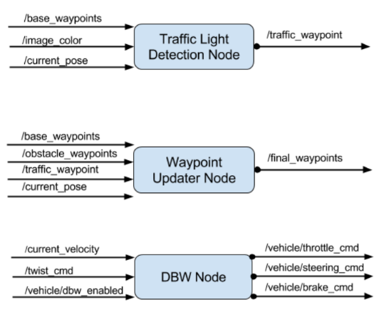

# Carmageddon team's project

## Introduction

The purpose of this (final) project was the implementation of an integrated system
capable of controlling the Carla, an autonomous Lincoln MKZ.

(TODO: write more)

## Team members

* Maciej Dziubinski (ponadto@gmail.com)
* Ankit Shrivastava (TODO: fill out)
* Mohamed Ameen (TODO: fill out)

## Project structure

The following picture presents the ROS nodes and ROS topics comprising the system:


As students, we were responsible for three nodes in particular:

* the `'tl_detector'` node (implemented in the `tl_detector` package) that publishes
  to the `/traffic_waypoint` topic the location to stop before a red light;
* the `'waypoint_updater'` node (implement in the `waypoint_updater` package)
  that publishes a list of waypoints (which determine the velocity) ahead of the
  car to the `/final_waypoints` topic;
* the `'dbw_node'` (in the `twist_controller` package) that publishes to three
  topics: `vehicle/throttle_cmd`, `/vehicle/brake_cmd`, and `/vehicle/steering_cmd`
  which control the car.

A good summary of those three nodes is presented below:



## Code structure

The following excerpt from the `tree` command summarizes the structure of the
`ros/src` directory (actually, the nodes that were presented in the
**Project structure** section above):

```
./ros/src
...
│
├── tl_detector
│   ├── light_classification
│   │   └── tl_classifier.py
│   ├── light_publisher.py
│   └── tl_detector.py
│
├── twist_controller
│   ├── dbw_node.py
│   ├── dbw_test.py
│   ├── lowpass.py
│   ├── pid.py
│   ├── twist_controller.py
│   └── yaw_controller.py
│
└── waypoint_updater
    └── waypoint_updater.py
```

### Details

TODO: place for implementational details (not too many)

## Traffic Light detection

TODO: guys, I leave this part for you ;)

### Method

TODO: I suspect this is where we'll say a few words about the chosen method

### Results

TODO: place for a few images showing how the classifier / detector worked

## Conclusions

TODO: final words
